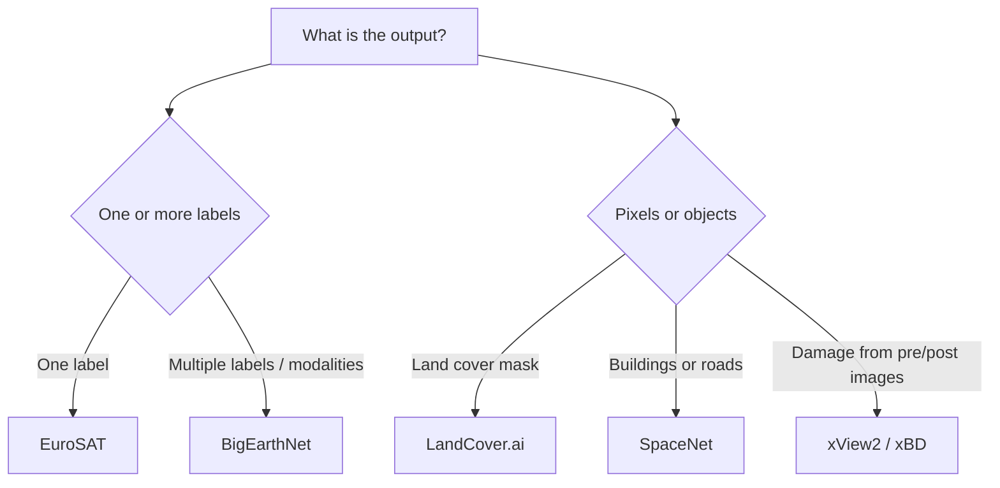

# 🌍 GeoVision Atlas

### A research-grade guide to five landmark datasets for deep learning in Earth observation

[](https://en.wikipedia.org/wiki/Remote_sensing)
[](https://pytorch.org/)
[](https://www.python.org/)
[](#dataset-at-a-glance)
[](#contributing)

> **From land-cover classification to post-disaster damage assessment:** this repository maps the data, tasks, evaluation protocols, and modeling choices behind **EuroSAT**, **BigEarthNet**, **SpaceNet**, **LandCover.ai**, and **xView2 / xBD**.

---

## Why this repository exists

Geospatial machine learning is not one task. A model that classifies a 64 × 64 Sentinel-2 patch is solving a fundamentally different problem from one that traces roads at sub-meter resolution or compares pre- and post-disaster images.

This guide helps you:

- select a dataset that matches your scientific question;
- understand sensor, resolution, label, and licensing differences;
- avoid spatial leakage and misleading random splits;
- choose task-appropriate architectures and metrics;
- build a reproducible path from raw GeoTIFFs to an experiment.

> [!IMPORTANT]
> This repository does **not** redistribute imagery or annotations. Download every dataset from its official source and accept any dataset-specific terms.

## Table of contents

- [Dataset at a glance](#dataset-at-a-glance)
- [Choose the right dataset](#choose-the-right-dataset)
- [The five datasets](#the-five-datasets)
  - [EuroSAT](#1-eurosat)
  - [BigEarthNet](#2-bigearthnet)
  - [SpaceNet](#3-spacenet)
  - [LandCover.ai](#4-landcoverai)
  - [xView2 / xBD](#5-xview2--xbd)
- [Task taxonomy](#task-taxonomy)
- [Reproducible environment](#reproducible-environment)
- [Data inspection starter](#data-inspection-starter)
- [Experimental design](#experimental-design)
- [Models and baselines](#models-and-baselines)
- [Metrics](#metrics)
- [Common failure modes](#common-failure-modes)
- [Responsible use](#responsible-use)
- [Citations](#citations)

## Dataset at a glance

| Dataset | Core task | Imagery | Scale / resolution | Labels | Best suited for |
|---|---|---|---|---|---|
| **[EuroSAT](https://github.com/phelber/EuroSAT)** | Single-label scene classification | Sentinel-2, RGB or 13 bands | 27,000 georeferenced 64 × 64 patches; 10 classes | One land-use / land-cover class per patch | First multispectral classifier, transfer learning, compact benchmarks |
| **[BigEarthNet v2.0](https://bigearth.net/)** | Multi-label scene classification; multimodal learning | Paired Sentinel-1 SAR + Sentinel-2 MSI | 549,488 S1/S2 patch pairs across 10 European countries | Multiple CLC-derived classes plus pixel-level reference maps | Large-scale pretraining, SAR–optical fusion, retrieval, multilabel learning |
| **[SpaceNet](https://spacenet.ai/datasets/)** | Building/road segmentation, graph extraction, change and flood mapping | Very-high-resolution satellite imagery; challenge-dependent sensors | ~67,000 km², >11M building footprints, ~20,000 km road labels across the collection | Polygons, roads, temporal/change or flood labels depending on challenge | Foundation mapping, instance segmentation, routing, multi-temporal research |
| **[LandCover.ai](https://landcover.ai.linuxpolska.com/)** | Semantic segmentation | RGB aerial orthophotos from Poland | 41 orthophotos; 25 or 50 cm/px; 216.27 km² | Buildings, woodland, water, roads | High-resolution land-cover segmentation and tiling experiments |
| **[xView2 / xBD](https://xview2.org/)** | Building localization + post-disaster damage classification | Paired pre/post very-high-resolution satellite imagery | Global disaster events; large-scale building annotations | Building polygons and ordinal damage classes | Change detection, humanitarian mapping, disaster-response research |

<details>
<summary><strong>Do not compare headline scores across these datasets</strong></summary>

They differ in ground-sample distance, spectral channels, spatial coverage, target geometry, class balance, split strategy, and evaluation metric. A 98% scene-classification accuracy on EuroSAT is not comparable to an IoU, AP, or topology score on SpaceNet.

</details>

## Choose the right dataset

| If your research question is… | Start with | Why |
|---|---|---|
| “Can I learn a strong land-use classifier quickly?” | **EuroSAT** | Small, approachable, and available in RGB and multispectral forms |
| “Can a model predict several co-occurring land-cover types?” | **BigEarthNet** | Large-scale, multi-label, multimodal Sentinel benchmark |
| “Can I extract buildings or routable roads from VHR imagery?” | **SpaceNet** | High-quality geometric labels and challenge-specific benchmarks |
| “Can I produce dense high-resolution land-cover masks?” | **LandCover.ai** | Simple four-class ontology with aerial RGB imagery and GeoTIFF masks |
| “Can I localize buildings and assess disaster damage from image pairs?” | **xView2 / xBD** | Purpose-built pre/post-event dataset with damage categories |



## The five datasets

### 1. EuroSAT

**EuroSAT** is a compact land-use and land-cover classification benchmark derived from Sentinel-2. It contains **27,000 labeled, georeferenced image patches**, **10 classes**, and a multispectral version with **13 bands**.

**Typical classes:** annual crop, forest, herbaceous vegetation, highway, industrial, pasture, permanent crop, residential, river, and sea/lake.

**Strengths**

- Low barrier to entry and fast iteration.
- RGB and multispectral variants enable controlled spectral-ablation studies.
- Excellent for transfer-learning tutorials and small-compute experiments.

**Watch-outs**

- Nearby patches can be visually and geographically correlated; random image-level splits may overestimate generalization.
- RGB and multispectral preprocessing are not interchangeable.
- Report the exact variant, bands, normalization, and split used.

**Official resources:** [repository](https://github.com/phelber/EuroSAT) · [dataset record](https://zenodo.org/records/7711810)

### 2. BigEarthNet

**BigEarthNet v2.0** pairs **549,488 Sentinel-1 and Sentinel-2 patches** over ten European countries. Samples have pixel-level reference maps and multiple labels derived from CORINE Land Cover 2018. The optical tiles were atmospherically corrected to Level-2A; the archive also includes metadata identifying snow, clouds, and cloud shadows.

**Strengths**

- Scale suitable for representation learning and modern foundation-model evaluation.
- Natural testbed for **SAR + optical fusion**.
- Multi-label targets reflect real land-cover co-occurrence.
- Official metadata, recommended splits, reference maps, and pretrained models are available.

**Watch-outs**

- Use **v2.0** deliberately; v1.0 and v2.0 differ in imagery, labels, and filtering.
- Do not treat multi-label targets as mutually exclusive classes.
- Cloud/snow/shadow patches require an explicit inclusion policy.
- The S1 and S2 archives are tens of GiB each; plan storage and streaming before training.

**Official resources:** [homepage and downloads](https://bigearth.net/) · [creation pipeline](https://github.com/BigEarthNet-pipeline/bigearthnet-pipeline)

### 3. SpaceNet

**SpaceNet** is a family of challenge datasets, not a single homogeneous benchmark. Across the collection it provides about **67,000 km²** of very-high-resolution imagery, **more than 11 million building footprints**, and approximately **20,000 km of road labels**.

| Challenge family | Primary problem |
|---|---|
| SpaceNet 1–2 | Building detection / footprint extraction |
| SpaceNet 3 | Road-network detection |
| SpaceNet 4 | Off-nadir building detection |
| SpaceNet 5 | Road extraction and route travel-time estimation |
| SpaceNet 6 | Multi-sensor, all-weather mapping |
| SpaceNet 7 | Multi-temporal urban development |
| SpaceNet 8 | Flooded-building and road segmentation |
| SpaceNet 9 | Cross-modal image registration |

**Strengths**

- Realistic VHR mapping problems with carefully designed competition metrics.
- Supports raster segmentation, vectorization, graph construction, and temporal reasoning.
- Diverse geographies and viewing conditions expose domain-shift problems.

**Watch-outs**

- Each challenge has its **own license, sensor, schema, split, and metric**.
- Pixel IoU alone can hide disconnected road graphs or unusable building geometry.
- Off-nadir imagery introduces roof displacement, occlusion, and footprint misalignment.

```bash
# Inspect the public bucket. Follow the current official AWS instructions.
aws s3 ls s3://spacenet-dataset/
```

**Official resources:** [dataset catalog](https://spacenet.ai/datasets/) · [AWS Open Data entry](https://registry.opendata.aws/spacenet/)

### 4. LandCover.ai

**LandCover.ai** targets dense semantic segmentation of Polish aerial orthophotos. Version 1 provides RGB imagery and masks for **building, woodland, water, and road** classes.

| Property | Value |
|---|---|
| Coverage | 216.27 km² |
| Imagery | 33 orthophotos at 25 cm/px; 8 at 50 cm/px |
| Raster format | Three-channel GeoTIFF |
| Mask format | Single-channel GeoTIFF |
| CRS | EPSG:2180 |
| Recommended chip size | 512 × 512 via the supplied split utility |
| License | CC BY-NC-SA 4.0 |

**Strengths**

- Straightforward class ontology and geospatial raster format.
- Native high resolution preserves narrow roads and building boundaries.
- Official train/validation/test chip lists support reproducible comparisons.

**Watch-outs**

- The **non-commercial** license condition matters for downstream use.
- Randomly splitting overlapping or adjacent chips creates serious leakage.
- Roads occupy relatively few pixels; macro metrics and class-aware sampling are important.
- Use **Version 1** unless reproducing historical Version 0 results.

**Official resource:** [dataset, splits, citation, and license](https://landcover.ai.linuxpolska.com/)

### 5. xView2 / xBD

**xView2** is the challenge; **xBD** is its disaster-damage dataset. It combines pre- and post-event satellite imagery with building polygons and ordinal damage labels. The task is usually decomposed into:

1. **Building localization** — identify building pixels or polygons.
2. **Damage classification** — assign `no damage`, `minor`, `major`, or `destroyed` to localized buildings.

**Strengths**

- Paired imagery enables change-aware and Siamese architectures.
- Covers multiple disaster types and regions.
- Direct relevance to humanitarian assistance and disaster recovery.

**Watch-outs**

- Damage labels are highly imbalanced and visually ambiguous.
- Misregistration between pre/post images can resemble real damage.
- Split by event and geography when evaluating deployment generalization.
- Do not imply that automated predictions replace field assessment.

**Official resources:** [challenge and download](https://xview2.org/) · [baseline](https://github.com/DIUx-xView/xView2_baseline) · [official scoring code](https://github.com/DIUx-xView/xView2_scoring) · [xBD paper](https://openaccess.thecvf.com/content_CVPRW_2019/html/cv4gc/Gupta_Creating_xBD_A_Dataset_for_Assessing_Building_Damage_from_Satellite_CVPRW_2019_paper.html)

## Task taxonomy

| Task | Input tensor | Target | Common loss | Primary metrics |
|---|---|---|---|---|
| Single-label classification | `C × H × W` | One class | Cross-entropy | Accuracy, macro-F1 |
| Multi-label classification | `C × H × W` or paired modalities | Multi-hot vector | BCE with logits, asymmetric/focal loss | macro/micro-F1, mAP, per-class AP |
| Semantic segmentation | `C × H × W` | Per-pixel class | CE + Dice / Lovász | mIoU, per-class IoU, Dice |
| Instance / building extraction | VHR image | Polygons or instances | Mask + box + class losses | AP, IoU, boundary quality |
| Road graph extraction | VHR image | Centerlines / graph | Segmentation plus topology-aware loss | APLS, connectivity, path error |
| Bi-temporal damage assessment | Pre/post pair | Building + damage | Localization + weighted class loss | localization F1, damage F1, official aggregate |

## Reproducible environment

```bash
python -m venv .venv
source .venv/bin/activate            # Windows: .venv\Scripts\activate
python -m pip install --upgrade pip
pip install torch torchvision rasterio geopandas shapely pyproj \
            albumentations scikit-learn matplotlib pandas tqdm
```

For larger experiments, consider adding:

```bash
pip install torchgeo lightning segmentation-models-pytorch \
            timm rioxarray xarray dask zarr
```

> [!TIP]
> Pin exact package versions in `requirements.txt`, `pyproject.toml`, or a lockfile before producing benchmark results.

### Suggested repository layout

```text
.
├── configs/                 # experiment and dataset configuration
├── data/
│   ├── raw/                 # immutable downloads; never commit
│   ├── interim/             # tiled/reprojected artifacts
│   └── processed/           # model-ready manifests
├── notebooks/               # exploration only
├── src/
│   ├── data/                # readers, tiling, normalization
│   ├── models/              # architectures and losses
│   ├── train.py
│   └── evaluate.py
├── tests/
├── outputs/                 # predictions, logs, checkpoints
└── README.md
```

Recommended `.gitignore` entries:

```gitignore
data/
outputs/
*.tif
*.tiff
*.jp2
*.ckpt
*.pt
.venv/
```

## Data inspection starter

Use geospatial readers rather than generic image libraries when coordinate metadata matters.

```python
from pathlib import Path
import numpy as np
import rasterio


def inspect_raster(path: str | Path) -> dict:
    path = Path(path)
    with rasterio.open(path) as src:
        sample = src.read(masked=True)
        return {
            "file": path.name,
            "shape": sample.shape,       # bands, height, width
            "dtype": str(sample.dtype),
            "crs": str(src.crs),
            "transform": tuple(src.transform),
            "bounds": tuple(src.bounds),
            "nodata": src.nodata,
            "valid_fraction": float((~np.ma.getmaskarray(sample)).mean()),
        }


print(inspect_raster("data/raw/example.tif"))
```

### Robust percentile visualization

Remote-sensing rasters often have higher bit depth than normal photographs. Do not blindly divide by 255.

```python
import numpy as np


def percentile_stretch(image_hwc, low=2, high=98):
    image = image_hwc.astype(np.float32)
    lo = np.percentile(image, low, axis=(0, 1), keepdims=True)
    hi = np.percentile(image, high, axis=(0, 1), keepdims=True)
    return np.clip((image - lo) / np.maximum(hi - lo, 1e-6), 0, 1)
```

### Manifest-first training

Keep split decisions in an auditable table rather than deriving them implicitly at runtime.

```text
sample_id,image_path,label_path,region,event,split
000001,data/raw/a.tif,data/raw/a.geojson,region_01,event_01,train
000002,data/raw/b.tif,data/raw/b.geojson,region_02,event_02,val
```

## Experimental design

### 1. Split geographically

Spatial autocorrelation makes nearby tiles look alike. A random tile split can place nearly identical landscapes in both training and test sets.

Prefer, in descending order:

1. official benchmark splits;
2. held-out regions, cities, tiles, or disaster events;
3. spatial blocks with a buffer between partitions;
4. random splits only for clearly labeled exploratory work.

### 2. Fit preprocessing on training data only

- Compute channel mean/std or percentiles from the training split.
- Fit label mappings, thresholds, and resampling policies without test data.
- Record band order explicitly, especially for Sentinel-2 and SAR/optical fusion.

### 3. Preserve geometry

- Apply identical spatial transforms to images and masks.
- Use nearest-neighbor interpolation for categorical masks.
- Track CRS and affine transforms whenever predictions must be mapped back to Earth coordinates.
- When rasterizing polygons, document `all_touched`, overlap, boundary, and ignore-index policies.

### 4. Report more than one seed

For each experiment, store:

```yaml
seed: 42
dataset_version: "explicit-version-here"
split_manifest: "manifests/split-v1.csv"
git_commit: "<commit-sha>"
image_size: [512, 512]
bands: ["explicit", "ordered", "band", "names"]
normalization: "train-set statistics"
metric_implementation: "official or versioned package"
```

Report the mean and standard deviation over multiple seeds when compute permits.

## Models and baselines

| Dataset / task | Lightweight baseline | Stronger direction | Research frontier |
|---|---|---|---|
| EuroSAT | ResNet-18 on RGB | multispectral ResNet / ConvNeXt | geospatial foundation-model linear probing |
| BigEarthNet | S2-only ResNet with BCE | S1/S2 late fusion, ViT | multimodal contrastive pretraining and missing-modality robustness |
| SpaceNet buildings | U-Net / DeepLabV3+ | instance segmentation, SegFormer | vector-native prediction and cross-city adaptation |
| SpaceNet roads | segmentation + skeletonization | topology-aware decoder | differentiable graph extraction and routing-aware objectives |
| LandCover.ai | U-Net | DeepLabV3+, U-Net++ | boundary-aware segmentation and resolution-robust models |
| xView2 / xBD | Siamese U-Net | shared encoder + localization/damage heads | event-generalizable change models with calibrated uncertainty |

### Sensible baseline rules

- Start simple enough to debug end to end.
- Use class weights, focal/asymmetric losses, or balanced sampling only after measuring imbalance.
- Compare RGB against multispectral inputs with matched splits and budgets.
- For paired images, test early fusion, late fusion, and explicit feature differences.
- Evaluate calibration if predictions may inform high-stakes decisions.

## Metrics

### Classification

For imbalanced datasets, accuracy alone is insufficient.

\[
F1_c = \frac{2\,P_cR_c}{P_c + R_c}
\qquad
F1_{macro} = \frac{1}{C}\sum_{c=1}^{C}F1_c
\]

Report per-class precision, recall, and F1 alongside macro/micro aggregates.

### Segmentation

\[
IoU_c = \frac{TP_c}{TP_c + FP_c + FN_c}
\qquad
mIoU = \frac{1}{C}\sum_{c=1}^{C}IoU_c
\]

Include per-class IoU. A high background score can otherwise obscure weak road, water, or building performance.

### Geometry and topology

- **Building footprints:** polygon IoU, AP, boundary F-score, and count error.
- **Road networks:** APLS or other graph-aware measures in addition to pixel metrics.
- **Damage assessment:** localization and damage F1, plus the exact official xView2 scoring implementation.

## Common failure modes

| Failure | Symptom | Prevention |
|---|---|---|
| Spatial leakage | Excellent validation score, poor new-region performance | Region/event-aware splits and spatial buffers |
| Wrong band order | Odd colors or unstable multispectral training | Named band registry and shape/range assertions |
| Mask interpolation | New invalid class IDs appear | Nearest-neighbor resampling for masks |
| Nodata treated as signal | Predictions follow tile borders | Explicit masks, padding policy, and nodata tests |
| CRS mismatch | Labels appear shifted or absent | Validate CRS, bounds, transform, and resolution together |
| Class imbalance | Majority class dominates | Per-class metrics, balanced sampling, calibrated loss weighting |
| Cloud/snow contamination | Spurious shortcuts | Metadata-based filtering and documented quality policy |
| Overlapping tile leakage | Near-duplicate train/test chips | Split parent scenes before tiling |
| Benchmark drift | Results cannot be reproduced | Pin dataset version, split manifest, code SHA, and metric code |

## Responsible use

Earth-observation models can support environmental analysis, mapping, and disaster response, but their predictions are not ground truth.

- **Human oversight:** damage and infrastructure predictions should be verified before operational use.
- **Uncertainty:** expose confidence and abstain under distribution shift.
- **Bias:** evaluate by geography, settlement type, disaster type, season, and sensor conditions.
- **Privacy and security:** consider whether high-resolution imagery reveals sensitive locations or activities.
- **Licensing:** dataset access does not automatically permit every commercial or derivative use.
- **Attribution:** cite the dataset papers and comply with imagery-provider terms.

## Citations

If you use a dataset, cite its original publication—not this README alone.

<details>
<summary><strong>EuroSAT</strong></summary>

```bibtex
@article{helber2019eurosat,
  title   = {EuroSAT: A Novel Dataset and Deep Learning Benchmark for Land Use and Land Cover Classification},
  author  = {Helber, Patrick and Bischke, Benjamin and Dengel, Andreas and Borth, Damian},
  journal = {IEEE Journal of Selected Topics in Applied Earth Observations and Remote Sensing},
  year    = {2019}
}
```
</details>

<details>
<summary><strong>BigEarthNet v2.0</strong></summary>

```bibtex
@inproceedings{clasen2025reben,
  title     = {reBEN: Refined BigEarthNet Dataset for Remote Sensing Image Analysis},
  author    = {Clasen, Kai Norman and Hackel, Leonard and Burgert, Tom and Sumbul, Gencer and Demir, Begum and Markl, Volker},
  booktitle = {IEEE International Geoscience and Remote Sensing Symposium},
  year      = {2025}
}
```
</details>

<details>
<summary><strong>SpaceNet</strong></summary>

```text
SpaceNet on Amazon Web Services (AWS). “Datasets.” The SpaceNet Catalog.
https://spacenet.ai/datasets/ (accessed on your actual access date).
```

Also cite the paper and terms listed on the page of the specific SpaceNet challenge you use.
</details>

<details>
<summary><strong>LandCover.ai</strong></summary>

```bibtex
@inproceedings{boguszewski2021landcoverai,
  title     = {LandCover.ai: Dataset for Automatic Mapping of Buildings, Woodlands, Water and Roads from Aerial Imagery},
  author    = {Boguszewski, Adrian and Batorski, Dominik and Ziemba-Jankowska, Natalia and Dziedzic, Tomasz and Zambrzycka, Anna},
  booktitle = {Proceedings of the IEEE/CVF Conference on Computer Vision and Pattern Recognition Workshops},
  pages     = {1102--1110},
  year      = {2021}
}
```
</details>

<details>
<summary><strong>xView2 / xBD</strong></summary>

```bibtex
@inproceedings{gupta2019xbd,
  title     = {Creating xBD: A Dataset for Assessing Building Damage from Satellite Imagery},
  author    = {Gupta, Ritwik and Goodman, Bryce and Patel, Nirav and Hosfelt, Ricky and Sajeev, Sandra and Heim, Eric and Doshi, Jigar and Lucas, Keane and Choset, Howie and Gaston, Matthew},
  booktitle = {Proceedings of the IEEE/CVF Conference on Computer Vision and Pattern Recognition Workshops},
  year      = {2019}
}
```
</details>

## Contributing

Contributions are welcome—especially corrected metadata, tested loaders, reproducible baselines, and geographically robust evaluation protocols.

1. Open an issue describing the proposed change.
2. Keep dataset facts linked to an official source or paper.
3. Never commit restricted imagery, credentials, or generated dataset archives.
4. Include a small test for loaders, transforms, or metrics.
5. Report hardware, package versions, seed, split, and dataset version with benchmark results.

## Acknowledgements

All credit for the imagery, annotations, benchmarks, and original research belongs to the respective dataset creators, imagery providers, institutions, and contributors.

---

<p align="center">
  <strong>Build models that understand where their data came from.</strong><br>
  <sub>Classification • Segmentation • Change Detection • Damage Assessment • Multimodal Earth Observation</sub>
</p>
